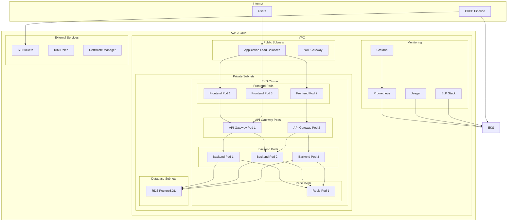

# Architecture Documentation

This document provides a comprehensive overview of the scalable infrastructure deployment architecture.

## High-Level Architecture



## Infrastructure Components

### 1. Networking Layer

#### Virtual Private Cloud (VPC)
- **CIDR Block**: 10.0.0.0/16
- **Availability Zones**: 3 zones for high availability
- **DNS Resolution**: Enabled for service discovery

#### Subnet Architecture
- **Public Subnets**: 10.0.48.0/24, 10.0.49.0/24, 10.0.50.0/24
  - Internet Gateway access
  - Load balancer endpoints
  - NAT Gateway instances

- **Private Subnets**: 10.0.0.0/24, 10.0.1.0/24, 10.0.2.0/24
  - EKS worker nodes
  - Application pods
  - Internal service communication

- **Database Subnets**: 10.0.52.0/24, 10.0.53.0/24, 10.0.54.0/24
  - RDS instances
  - Database isolation
  - Multi-AZ deployment

### 2. Compute Layer

#### Amazon EKS Cluster
- **Version**: Kubernetes 1.28
- **Node Groups**: Managed node groups for reliability
- **Instance Types**: t3.medium, t3.large, t3.xlarge
- **Auto Scaling**: 1-20 nodes based on demand
- **Networking**: CNI plugin for pod networking

#### Node Configuration
```yaml
nodeGroups:
  main:
    instanceTypes: ["t3.medium", "t3.large"]
    minSize: 1
    maxSize: 20
    desiredSize: 3
    capacityType: "ON_DEMAND"
```

### 3. Data Layer

#### Amazon RDS PostgreSQL
- **Engine**: PostgreSQL 15.4
- **Instance Class**: db.t3.micro (dev), db.t3.small (prod)
- **Storage**: 20GB (dev), 100GB (prod)
- **Backup**: 7-day retention
- **Multi-AZ**: Enabled for production

#### Redis Cache
- **Deployment**: Kubernetes pods
- **Persistence**: Persistent volume claims
- **Memory**: 256Mi requests, 512Mi limits
- **Usage**: Session storage, caching, rate limiting

### 4. Application Layer

#### Microservices Architecture

##### Frontend Service
- **Technology**: React 18 with Material-UI
- **Deployment**: Nginx containers
- **Replicas**: 3 (min), 10 (max)
- **Resources**: 128Mi memory, 100m CPU

##### API Gateway Service
- **Technology**: Node.js with Express
- **Features**: Rate limiting, authentication, routing
- **Replicas**: 2 (min), 15 (max)
- **Resources**: 256Mi memory, 250m CPU

##### Backend Service
- **Technology**: Node.js with TypeScript
- **Features**: Business logic, database operations
- **Replicas**: 3 (min), 20 (max)
- **Resources**: 256Mi memory, 250m CPU

#### Service Communication
```yaml
communication:
  frontend -> api-gateway: HTTP/HTTPS
  api-gateway -> backend: HTTP/HTTPS
  backend -> database: PostgreSQL protocol
  backend -> redis: Redis protocol
  monitoring -> all-services: Metrics collection
```

### 5. Security Layer

#### Network Security
- **Security Groups**: Layer-3/4 filtering
- **Network Policies**: Kubernetes pod-to-pod filtering
- **Private Subnets**: No direct internet access
- **Encryption**: In-transit and at-rest

#### Access Control
- **IAM Roles**: Service-specific permissions
- **RBAC**: Kubernetes role-based access control
- **Secrets**: Kubernetes secrets management
- **Authentication**: JWT-based API authentication

#### Container Security
- **Non-root Users**: All containers run as non-root
- **Image Scanning**: Trivy vulnerability scanning
- **Resource Limits**: CPU and memory constraints
- **Security Contexts**: Pod security standards

### 6. Monitoring and Observability

#### Metrics Collection
- **Prometheus**: Time-series metrics storage
- **Node Exporter**: Node-level metrics
- **cAdvisor**: Container metrics
- **Custom Metrics**: Application-specific metrics

#### Visualization
- **Grafana**: Dashboard and visualization
- **Pre-built Dashboards**: Kubernetes, application metrics
- **Alerting**: Threshold-based notifications
- **Custom Panels**: Business-specific visualizations

#### Distributed Tracing
- **Jaeger**: Distributed tracing backend
- **OpenTelemetry**: Instrumentation libraries
- **Trace Correlation**: Request flow tracking
- **Performance Analysis**: Latency and bottleneck identification

#### Log Aggregation
- **ELK Stack**: Elasticsearch, Logstash, Kibana
- **Fluentd**: Log collection and forwarding
- **Centralized Logging**: All services log aggregation
- **Log Analysis**: Search and analytics capabilities

## Scalability Patterns

### Horizontal Scaling
```yaml
scaling:
  pods:
    hpa: "CPU > 70% or Memory > 80%"
    minReplicas: 2
    maxReplicas: 20
  
  nodes:
    clusterAutoscaler: "Pod pending"
    minNodes: 1
    maxNodes: 20
```

### Vertical Scaling
- **Resource Requests**: Guaranteed resources
- **Resource Limits**: Maximum resource usage
- **Quality of Service**: Burstable and guaranteed pods
- **Node Sizing**: Right-sized instances

### Database Scaling
- **Read Replicas**: Read workload distribution
- **Connection Pooling**: Efficient connection management
- **Query Optimization**: Performance tuning
- **Caching**: Redis for frequently accessed data

## High Availability Design

### Multi-AZ Deployment
- **Availability Zones**: 3 zones minimum
- **Pod Distribution**: Anti-affinity rules
- **Data Replication**: Multi-AZ RDS
- **Load Distribution**: Cross-AZ load balancing

### Fault Tolerance
- **Health Checks**: Liveness and readiness probes
- **Circuit Breakers**: Failure isolation
- **Retry Logic**: Exponential backoff
- **Graceful Degradation**: Service degradation strategies

### Disaster Recovery
- **Backup Strategy**: Automated backups
- **Recovery Procedures**: Documented recovery steps
- **RTO/RPO**: Recovery time and point objectives
- **Testing**: Regular disaster recovery drills

## Performance Characteristics

### Latency Targets
- **API Response**: < 200ms (95th percentile)
- **Database Queries**: < 100ms (average)
- **Cache Access**: < 10ms (average)
- **Page Load**: < 2 seconds

### Throughput Targets
- **API Requests**: 10,000 requests/minute
- **Database Connections**: 100 concurrent connections
- **Cache Operations**: 50,000 operations/second
- **File Uploads**: 100MB/second

### Resource Utilization
- **CPU Usage**: 60-70% average
- **Memory Usage**: 70-80% average
- **Network**: 1Gbps sustained
- **Storage**: IOPS optimized

## Cost Optimization

### Resource Optimization
- **Spot Instances**: Non-critical workloads
- **Reserved Instances**: Predictable workloads
- **Auto Scaling**: Right-sizing resources
- **Resource Tagging**: Cost allocation

### Storage Optimization
- **Lifecycle Policies**: S3 storage classes
- **Compression**: Log and data compression
- **Deduplication**: Image layer sharing
- **Cleanup**: Automated resource cleanup

## Security Considerations

### Data Protection
- **Encryption**: AES-256 encryption
- **Key Management**: AWS KMS integration
- **Data Classification**: Sensitive data handling
- **Compliance**: SOC 2, PCI DSS considerations

### Network Security
- **Zero Trust**: Principle of least privilege
- **Microsegmentation**: Service isolation
- **Firewall Rules**: Restrictive security groups
- **VPN Access**: Secure administrative access

### Application Security
- **Input Validation**: Sanitization and validation
- **Authentication**: Multi-factor authentication
- **Authorization**: Role-based access control
- **Audit Logging**: Comprehensive audit trails

## Operational Excellence

### Automation
- **Infrastructure as Code**: Terraform automation
- **GitOps**: Declarative configuration
- **CI/CD**: Automated deployments
- **Self-Healing**: Automatic recovery

### Monitoring
- **SLI/SLO**: Service level indicators
- **Alerting**: Proactive issue detection
- **Dashboards**: Real-time visibility
- **Incident Response**: Documented procedures

### Documentation
- **Runbooks**: Operational procedures
- **Architecture Docs**: System documentation
- **API Docs**: Service documentation
- **Troubleshooting**: Common issues and solutions
